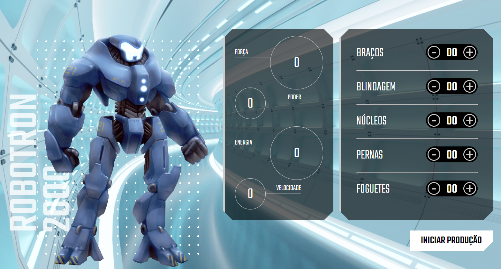

# Robotron-2000

Curso realizado com Alura e o instrutor <strong>Pedro Marins.</strong>

## Conteúdo
- Manipulação do DOM;
- Implementações JavaScript;
- Manipulação de dados, eventos e elementos com JavaScript;
- Página dinâmica;